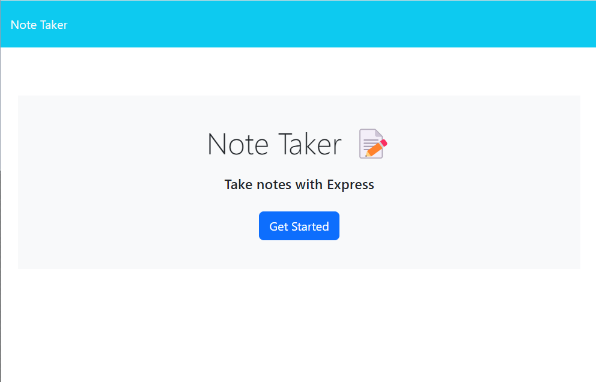
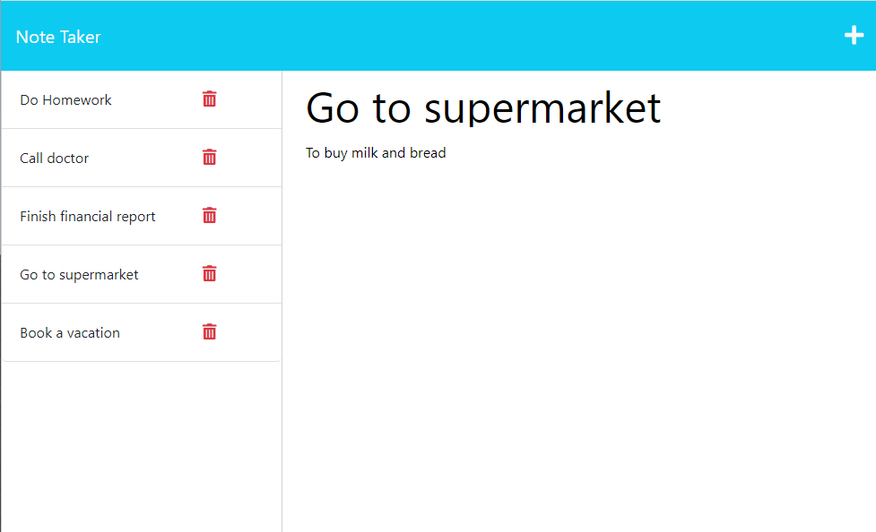

# Note Taker
  

  ## Description 

  Web application that can be used to write and save notes. Notes can be modified and deleted. This application uses an Express.js back end and saves and retrieves note data from a JSON file.

  ## Table of Contents

- [Usage](#usage)
- [Questions](#questions)
- [License](#license)

## Usage

Link to deployed application: 

User is able to add a new note, review and update existing note by selecting from left hand side, and delete note by clicking delete icon next to the note. 

## Questions
GitHub profile: [vlada-caban](https://github.com/vlada-caban)

## License 
License: MIT